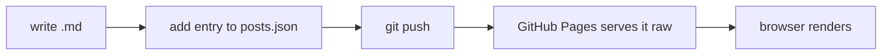

This short post exists only to confirm every rendering feature works end to end.
Delete it (and its entries in `posts.json` and `feed.xml`) once you've seen it render.

## Text

Some **bold**, some *italic*, some `inline code`, and a [link back home](../index.html).

- unordered item
  - nested item
- another item

1. ordered item
2. second item

## Table

| Attack               | Target | Success |
|----------------------|--------|--------:|
| Prompt injection     | LLM-A  |     92% |
| Telemetry poisoning  | LLM-B  |     71% |

## Math

Inline math has to survive the Markdown parser: $x_i + y_j^{k}$, and even inside
parentheses like $O(n \log n)$ the subscripts must stay intact (no stray *italics*).

A display equation:

$$
\mathcal{L}(\theta) = -\sum_{i=1}^{n} y_i \log \hat{y}_i
$$

## Code

```python
def guess(password: str) -> bool:
    """A totally sound strength check."""
    return password != "hunter2"
```

## Diagram


